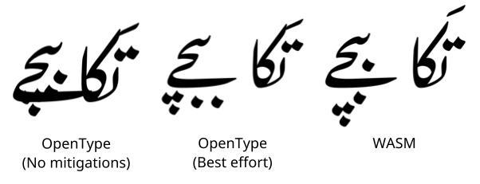

# WASM Shaper Demonstrations

This repository contains sources and binaries of example fonts using the Harfbuzz WASM Shaper.

## What do they demonstrate and why?

### gulzar

Urdu Nastaliq typography has long been seen as a challenge which pushes up against the limitations of OpenType Layout. John Hudson's TypeCon talk "Problems of Adjacency" ([slide 21-](http://tiro.com/John/TypeCon2014_Hudson_DECK.pdf#page=21)) illustrates some of the challenges of Nastaliq layout:

* Kerning between the bari ye glyph at the end of one word and the final glyph of the *previous word* is highly contextual, dependent entirely on the length of the word.
* Dots falling underneath the bari ye must be moved vertically to avoid the bari ye stroke, ideally to a consistent distance below the stroke regardless of their original Y offset. This is also highly contextual; trying to work out whether or not a glyph is above the bari ye depends entirely on the width and height of a variable number of glyphs following it.
* Dot positioning in general must be careful to avoid collisions both with other dots and with base characters.
* [Nastaliq kerning](https://simoncozens.github.io/nastaliq-autokerning/) is highly contextual dependent on the eventual Y position of the glyphs involved.

Each of these challenges *can* be largely overcome through approximation and enumerating a huge number of possible sequences; but the approximation is imperfect and there are still mistakes; and because the sequences are enumerated statically in advance, each of these challenges requires thousands - sometimes tens of thousands - of OpenType rules. As John says,

> As with the spacing problem, the quantity
and complexity of the lookups involved is huge, presenting challenges for workflows, font compilation, and performance...  But it is still a workaround: a convoluted hack to bypass the limitations of an inappropriate paradigm.

The `gulzar` directory contains a Nastaliq Urdu font which solves these problems; it has a Nastaliq-specific shaping engine which:

* computes the width of bari-ye sequences and adjusts the spacing of the previous word appropriately.
* computes the height of dots under bari ye and moves them underneath.
* detects and mitigates overlaps in glyph outlines, repositioning diacritics to avoid collisions.
* measures the height and contours of word endings and word beginnings to create even spacing.

All this is done at run-time by specifying the desired positioning behaviour directly, rather than enumerating the possibilities, meaning that the WASM font is one third the size of the OT implementation.



### hieroglyphs

The encoding model of Egyptian hieroglyphics is unlike any other system in Unicode. It is based on the concept of repeated subdivisions of the "quadrat" (what typographers would think of as the em-square). For example, the following symbol found in the second text of Urkuden IV:


is encoded as follows:


* Vertical subdivision of:
    - Loaf of bread
    - Top-right insertion of:
        + Duck
        + Horizontal subdivision
            * Stroke
            * Loaf of bread

These "insertion" and "subdivision" characters are Unicode formatting controls; there are even bracketing controls ("start sequence", "end sequence"), such that the actual Unicode encoding is more like:

```
<LOAF OF BREAD> <VERTICAL JOINER> <DUCK> <TOP-RIGHT INSERTION> <BEGIN SEQUENCE> <STROKE> <HORIZONTAL JOINER> <LOAF OF BREAD> <END SEQUENCE>
```

This is obviously a recursive grammar and requires an LALR parser even to correctly parse an arbitrary Unicode sequence, let alone to implement layout. Andrew Glass has attempted to implement a [parser and layout engine](https://github.com/microsoft/font-tools/tree/main/EgyptianOpenType) in OpenType Layout rules alone, but once again the clunkiness of the system - tens of thousands of inscrutable rules, hundreds of "marker glyphs", and a maximum of three levels of embedding - suggest that a more ergonomic approach is possible.

The `hieroglyphs` directory contains an LALR parser implementation which is relatively simple to follow, together with a recursive layout algorithm which allows for arbitrary levels of nesting.

## shadow

WASM shapers have aesthetic benefits as well. One perennial problem with colour fonts is that the painting is done on a per-glyph basis. So in the string "ABC", all layers of the "A" glyph are painted first, then all layers of the "B" glyph and so on. For layer fonts with "shadows" or other effects which poke out the left hand side of the glyph, this leads to output like the following:


When using a WASM-based custom shaping engine, we can replicate the entire glyph stream, painting first the shadow layer, and then performing a "carriage return" by adding a negative advance totalling the whole advance of the current glyph stream, and then painting the base layer glyphs, like so:


This simply isn't possible to achieve in OpenType without modification of the colour rendering process.

## network

## ruqaa
