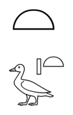
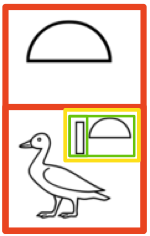
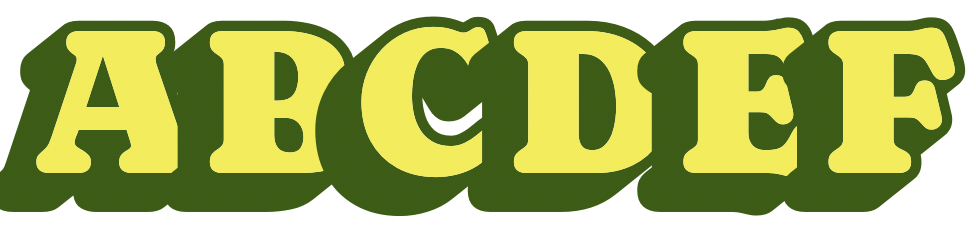
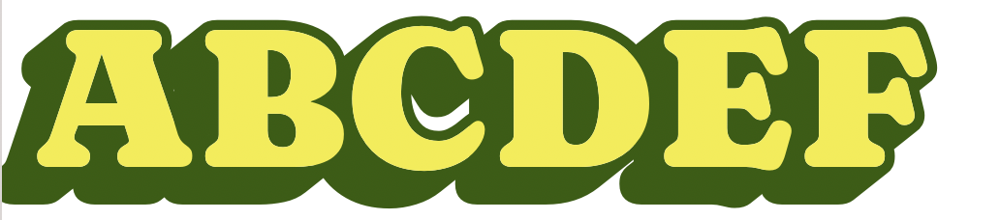
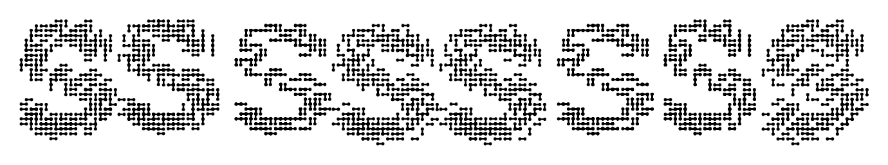
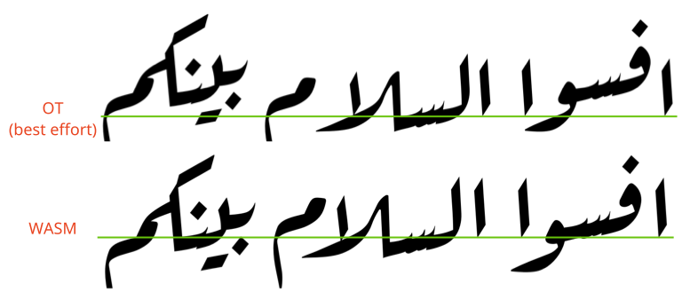
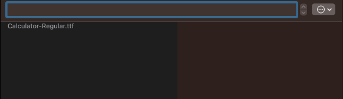
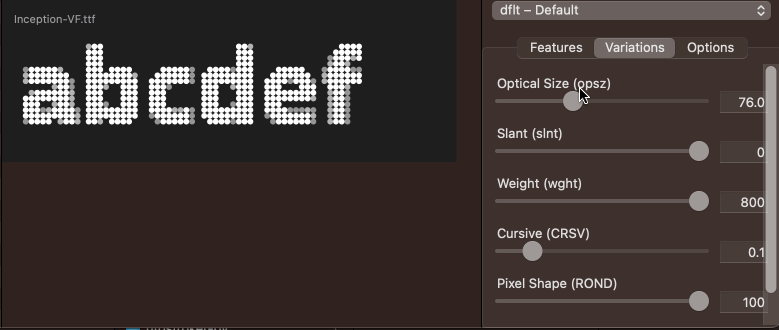
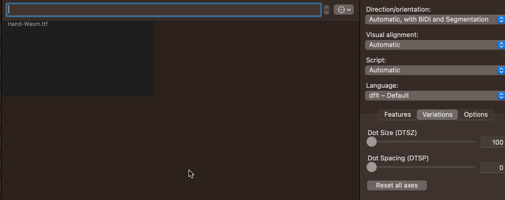

# WASM Shaper Demonstrations

This repository contains sources and binaries of example fonts using the Harfbuzz WASM Shaper.

## Preliminaries

* There is a version of FontGoggles compiled to use the Harfbuzz WASM shaper *for M1 macs* in the [fontgoggles-wasm-m1](fontgoggles-wasm-m1/) directory.
* To learn more about writing your own Harfbuzz WASM shapers, first read [the WASM shaper docs](https://github.com/harfbuzz/harfbuzz/blob/wasm/docs/wasm-shaper.md).
* Next look through the documentation for the [Rust WASM shaper interface](harfbuzz-wasm/src/lib.rs).
* The Harfbuzz WASM shaper is an experimental technology. Feel free to play with it, but don't expect to use it in your fonts any time in the next few years...

## What do they demonstrate and why?

### nastaliq

Urdu Nastaliq typography has long been seen as a challenge which pushes up against the limitations of OpenType Layout. John Hudson's TypeCon talk "Problems of Adjacency" ([slide 21-](http://tiro.com/John/TypeCon2014_Hudson_DECK.pdf#page=21)) illustrates some of the challenges of Nastaliq layout:

* Kerning between the bari ye glyph at the end of one word and the final glyph of the *previous word* is highly contextual, dependent entirely on the length of the word.
* Dots falling underneath the bari ye must be moved vertically to avoid the bari ye stroke, ideally to a consistent distance below the stroke regardless of their original Y offset. This is also highly contextual; trying to work out whether or not a glyph is above the bari ye depends entirely on the width and height of a variable number of glyphs following it.
* Dot positioning in general must be careful to avoid collisions both with other dots and with base characters.
* [Nastaliq kerning](https://simoncozens.github.io/nastaliq-autokerning/) is highly contextual dependent on the eventual Y position of the glyphs involved.

Each of these challenges *can* be largely overcome through approximation and enumerating a huge number of possible sequences; but the approximation is imperfect and there are still mistakes; and because the sequences are enumerated statically in advance, each of these challenges requires thousands - sometimes tens of thousands - of OpenType rules. As John says,

> As with the spacing problem, the quantity
and complexity of the lookups involved is huge, presenting challenges for workflows, font compilation, and performance...  But it is still a workaround: a convoluted hack to bypass the limitations of an inappropriate paradigm.

The `nastaliq` directory contains a Nastaliq Urdu font which solves these problems; it has a Nastaliq-specific shaping engine which:

* computes the width of bari-ye sequences and adjusts the spacing of the previous word appropriately.
* computes the height of dots under bari ye and moves them underneath.
* detects and mitigates overlaps in glyph outlines, repositioning diacritics to avoid collisions.
* measures the height and contours of word endings and word beginnings to create even spacing.

All this is done at run-time by specifying the desired positioning behaviour directly, rather than enumerating the possibilities, meaning that the WASM font is over 100k smaller than the size of the OT implementation.


*The Nastaliq shaper is 630 lines of Rust code. It has copious comments, so you should be able to follow it, but maybe don't start with this one.*

**IMPORTANT DISCLAIMER. Noto Nastaliq WASM is just a quick proof of concept designed to demonstrate what is possible with the WASM shaper, and should not be understood to demonstrate Nastaliq; there are many bugs, and it's not an accurate reflection of good calligraphic style.**

---

### hieroglyphs

The encoding model of Egyptian hieroglyphics is unlike any other system in Unicode. It is based on the concept of repeated subdivisions of the "quadrat" (what typographers would think of as the em-square). For example, the following symbol found in the second text of Urkuden IV:



is encoded as follows:



* Vertical subdivision of:
    - Loaf of bread
    - Top-right insertion of:
        + Duck
        + Horizontal subdivision
            * Stroke
            * Loaf of bread

These "insertion" and "subdivision" characters are Unicode formatting controls; there are even bracketing controls ("start sequence", "end sequence"), such that the actual Unicode encoding is more like:

```
<LOAF OF BREAD> <VERTICAL JOINER> <DUCK> <TOP-RIGHT INSERTION> <BEGIN SEQUENCE> <STROKE> <HORIZONTAL JOINER> <LOAF OF BREAD> <END SEQUENCE>
```

This is obviously a recursive grammar and requires an LALR parser even to correctly parse an arbitrary Unicode sequence, let alone to implement layout. Andrew Glass has attempted to implement a [parser and layout engine](https://github.com/microsoft/font-tools/tree/main/EgyptianOpenType) in OpenType Layout rules alone, but once again the clunkiness of the system - tens of thousands of inscrutable rules, hundreds of "marker glyphs", and a maximum of three levels of embedding - suggest that a more ergonomic approach is possible.

The `hieroglyphs` directory contains an LALR parser implementation which is relatively simple to follow, together with a recursive layout algorithm which allows for arbitrary levels of nesting.

*The Hieroglyphics shaper is 500 lines of uncommented Rust LALR and parser code. I wouldn't start here either.*

---

### shadow

WASM shapers have aesthetic benefits as well. One perennial problem with colour fonts is that the painting is done on a per-glyph basis. So in the string "ABC", all layers of the "A" glyph are painted first, then all layers of the "B" glyph and so on. For layer fonts with "shadows" or other effects which poke out the left hand side of the glyph, this leads to output like the following:



When using a WASM-based custom shaping engine, we can replicate the entire glyph stream, painting first the shadow layer, and then performing a "carriage return" by adding a negative advance totalling the whole advance of the current glyph stream, and then painting the base layer glyphs, like so:



This simply isn't possible to achieve in OpenType without modification of the colour rendering process.

*The "shadow" shaping engine is **37** lines of Rust code. That's barely more than a screenful!*

---

### network

Similarly, another long-standing dream of designers has been the ability to randomize glyphs and positions. Within the limited range of operations available in OpenType layout, even the best applications of "randomness" are rudimentary and unconvincing. Harfbuzz implements the `rand` feature which provides for random substitution from a choice of alternates, but not random positioning or any other application of randomness. While we do not recommend that a WASM based shaper has access to a truly random entropy source, the flexibility of WASM shaping allows for "better" pseudorandomness (in terms of more complex pseudorandomness algorithms), random positioning and, gathering entropy from the input glyph sequence.

The `network` example takes each glyph and overlays it twice, each time at one of twenty-five (pseudo-)randomly chosen positions, to create 125 different variants.



*The "network" shaper is 71 lines of Rust code. You can follow it!*

---

### ruqaa

The model of OpenType Layout is intrinsically local: "at *this* glyph or class of glyphs, do *this*." But some layout problems require non-local computation. 

The Ruqaa style of Arabic requires each "word" to be vertically centered on the baseline. The appropriate vertical shift must therefore be computed by totalling the "rise" (vertical difference between entry and exit anchors) across an arbitrary length of word and with different vertical rises per letter, halved, and then applied globally to the word.

As with the Nastaliq example, it is possible to enumerate and pre-compute all potential cases, but at the cost of huge numbers of layouts and slow rendering. These kind of problems which require *calculation*, such as summing distances or vertical positions, highlight the need for a more computational approach to layout where arithmetic can be performed directly.

The `ruqaa` example implements this baseline balancing, and throws in some automated kerning as well for good measure.



*The "network" shaper is 431 lines of Rust code, mainly because it steals the kerning from the nastaliq shaper.*

---

### calculator

Having established the need for "calculation" during layout, why not just use the font as a calculator?



*The "calculator" shaper is 58 lines of Rust code. Most of it is regular expressions to parse the input text.*

---

### inception

Inception puts a font inside a font. The "inner font" is Stephen Nixon's [Recursive](https://fonts.google.com/specimen/Recursive) (what else!); the outer font contains three identical glyphs - three small circles of different colours.

When text is shaped in `inception`, the WASM code runs the shaping engine on the *inner* font. The code next calls an embedded [rasterizing library](https://docs.rs/ab_glyph_rasterizer/latest/ab_glyph_rasterizer/index.html) which rasterizes the font into pixels at a given resolution, specified through the optical size variable axis.

The grid of pixels returned by the rasterizer is then assembled into a Harfbuzz buffer representing an arrangement of the pixel glyphs; the buffer is finally handled back to Harfbuzz for layout and further rasterization.

The end result of this is a "pixel machine", which generates an infinite variety of pixellated fonts at custom pixels-per-em resolution.



*The "inception" shaper is admittedly complex, but it's only 159 lines of really heavily commented Rust code. You'll be fine!*

---

### handwriting

In a similar vein, a long-standing problem is creating dotted fonts, particularly for joined script. Ideally one would want to treat a sequence of connected glyphs as a single line, to ensure that dots placed along one glyph will not collide with dots placed along the previous or next glyph. This problem becomes intractable when variable fonts are introduced into the mix: how do we ensure consistent dot spacing along a line *and* variable font interpolatability? It's impossible to create an interpolatable variable font when the number of dots in a glyph at one location on a variation axis is different from the number of dots at a different location.

But with WASM we can place the dots at runtime, collecting a sequence of strokes into a single Bezier path and then dotting the path as a unity, using user-supplied size and spacing values. Like this:



*The "handwriting" shaper is 179 lines of uncommented Rust code. I'll comment it soon.*

